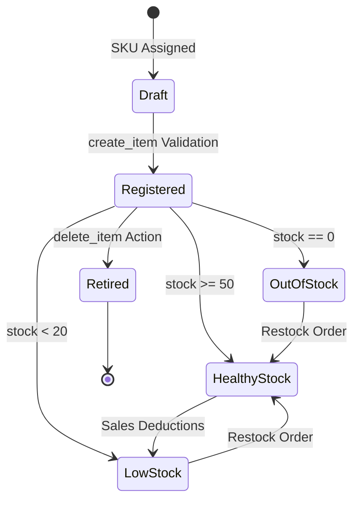
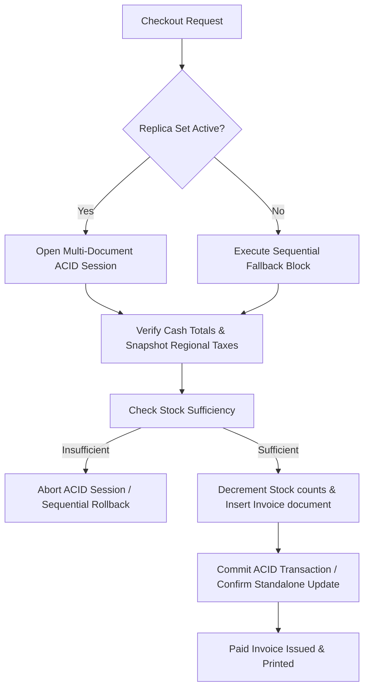

# WareOps ERP — Asynchronous Enterprise Backend

This is the secure, modular, asynchronous enterprise SaaS backend for **WareOps ERP**, architected in **Python** using **FastAPI** and a **MongoDB-first** database strategy. It serves as a highly scalable Modular Monolith, designed with clean interfaces to allow individual modules to seamlessly split into microservices in the future.

---

## 🚀 Key Architectural Priorities

- **Modular Monolith**: Strict boundary isolation where modules have self-contained layers (routers, services, schemas, models, repositories) and are prohibited from querying other module collections directly.
- **Tenant & Warehouse Isolation**: Automatic tenant scoping applied globally via FastAPI dependency injection guards on database query filters.
- **MongoDB-First Database Strategy**: High-performance JSON-native document storage for core relational, dynamic tables, and audit trail events. Atomic operations across collections are handled via MongoDB Multi-Document ACID Transactions.
- **Dynamic Table Builder**: An Airtable-like runtime column validation system. Columns, headers, and validation schemas live in a `table_schemas` collection, with dynamic rows saved in `table_rows` and validated on write via runtime Pydantic configurations.
- **Enterprise-Grade Security**:
  - **Argon2id Hashing**: configured with optimal parameters ($m=65536, t=3, p=4$) for password protection.
  - **Token Rotation**: Short-lived HMAC-SHA256 JWT access tokens (15 mins) combined with httpOnly, secure, rotating refresh tokens (7 days) tracked in Redis/MongoDB.
  - **Role-Based Access Control (RBAC)**: Enforced privilege hierarchy: `employee` (1) < `staff` (2) < `manager` (3) < `admin` (4) < `super_admin` (5).
- **Double-Entry Financial Math**: All billing/invoice totals and calculations are executed via Python's `decimal.Decimal` module and stored in MongoDB's `Decimal128` format to eliminate floating-point math rounding issues.

---

## 📂 Project Organization

The repository strictly preserves a scalable, modular design. Each module is fully encapsulated:

```
src/
├── main.py                   # FastAPI Application Entry Point
├── config.py                 # Pydantic BaseSettings Configuration Loader
├── database.py               # Motor Asynchronous MongoDB Client & Session Registry
├── middleware/               # CORS, Security Headers, Custom Logging
└── modules/
    ├── auth/                 # Authentication, JWT handling, Argon2id
    ├── warehouses/           # Warehouse registries
    ├── items/                # Catalog item and SKU level management
    ├── billing/              # Invoice compilation & credit note double-entry balance
    ├── dynamic_tables/       # Custom Airtable-like table schemas & dynamic data rows
    ├── workforce/            # Staff roles & privilege hierarchies
    └── audit_logs/           # Secure, write-once user operation logging
```

Inside each module, boundaries are preserved across these layers:
* `router.py`: API endpoint pathways and FastAPI dependencies.
* `service.py`: Orchestration of business workflows.
* `schema.py`: Pydantic models for validation of incoming and outgoing payloads.
* `model.py`: Data type mapping representing MongoDB records.
* `repository.py`: Motor asynchronous query operations.
* `utils.py`: Specific module auxiliary helper tools.

---

## 🚦 Router Endpoint Tree

All endpoints reside under the `/api/v1` namespace and preserve the following routing:

| Module Route Prefix | Method | Endpoint Path | Authentication | Description |
| :--- | :---: | :--- | :---: | :--- |
| **`/api/v1/auth`** | POST | `/signup` | Public | Registers a new Super Admin tenant |
| | POST | `/login` | Public | Authenticates and returns access & refresh tokens |
| | POST | `/refresh` | httpOnly Cookie | Rotates and issues a new access/refresh token pair |
| | POST | `/logout` | JWT | Invalidates the active session and tokens |
| **`/api/v1/warehouses`** | GET | `/` | JWT | Lists active warehouses (scopes based on roles) |
| | POST | `/` | JWT | Creates a new warehouse registry |
| | GET | `/{id}` | JWT | Fetches a specific warehouse's detailed registry |
| | PUT | `/{id}` | JWT | Modifies a warehouse profile |
| | DELETE | `/{id}` | JWT | Cascade deletes a warehouse and all associated data |
| **`/api/v1/items`** | GET | `/` | JWT | Fetches catalog items matching warehouse scope |
| | POST | `/` | JWT | Registers new item (evaluates SKU uniqueness) |
| | PUT | `/{id}` | JWT | Adjusts stock levels or specifications |
| | DELETE | `/{id}` | JWT | Removes item from catalog |
| **`/api/v1/billing`** | GET | `/` | JWT | Lists invoices under tenant (hierarchical view) |
| | POST | `/` | JWT | Generates bill (triggers atomic stock deduction) |
| | GET | `/{id}/print` | JWT | Streams invoice calculation PDF |
| **`/api/v1/dynamic-tables`**| GET | `/` | JWT | Retrieves custom schemas registered for warehouse |
| | POST | `/` | JWT | Creates a custom Airtable-like metadata schema |
| | GET | `/{tableId}/rows` | JWT | Fetches rows matching schema (dynamic schema validated) |
| | POST | `/{tableId}/rows`| JWT | Appends rows into document collection |
| **`/api/v1/workforce`** | GET | `/` | JWT | Lists staff members matching scope constraints |
| | POST | `/` | JWT | Creates new staff profile (cannot exceed caller privilege) |
| | PUT | `/{id}` | JWT | Updates role assignment or workforce status |
| **`/api/v1/audit-logs`** | GET | `/` | JWT | Pulls historical user action trail (write-once) |

---

## 🛠️ Developer Setup & Launch

1. **Virtual Environment Setup**:
   ```bash
   python -m venv .venv
   .venv\Scripts\activate   # Windows
   source .venv/bin/activate # Unix/macOS
   ```
2. **Install Dependencies**:
   ```bash
   pip install -r requirements.txt
   ```
3. **Environment Setup**:
   Copy `.env.example` to `.env` and adjust database variables.
4. **Run Application**:
   ```bash
   uvicorn src.main:app --reload --host 127.0.0.1 --port 8000
   ```
   Open [http://127.0.0.1:8000/docs](http://127.0.0.1:8000/docs) to access Swagger OpenAPI interactive documentation.

---

## 📦 Phase 5 — Scoped Item Catalog & Inventory Management

Phase 5 introduces a robust, enterprise-grade inventory system with warehouse-scoped partitioning, exact Decimal pricing math, and dashboard-optimized analytics pipelines.

### 1. Inventory Architecture

The inventory module utilizes a clean repository-service pattern inside [src/modules/items/](file:///c:/Users/sr2ma/OneDrive/Documents/GitHub/backend-warehouse/src/modules/items/). The backend is mathematically secure: prices and stock values are tracked utilizing Python's `decimal.Decimal` module and stored in MongoDB's native high-precision `Decimal128` format. This prevents floating-point issues during billing allocations.

### 2. Inventory Lifecycle Flow



### 3. Warehouse-Scoped Isolation

Tenant boundaries are enforced dynamically at the database repository query layer:
* **Super Admin**: Has global visibility across all registered warehouses.
* **Admin, Manager, Staff**: Query filters are strictly forced to their assigned `warehouse_id`. Staff have read-only access.
* **Employee**: Read-only catalog visibility.

SKU uniqueness is enforced per warehouse partition, allowing identical product SKUs to exist across different warehouses under the same tenant without catalog collision.

### 4. Optimized Aggregation & Dashboard Pipelines

The backend exposes four advanced analytics routes under `/api/v1/items/analytics/` specifically optimized for graphs, KPI cards, and smart AI restocking tables:

```
                  ┌──────────────────────────────┐
                  │   FastAPI Analytics Router   │
                  └──────────────┬───────────────┘
                                 │
         ┌───────────────────────┼───────────────────────┐
         ▼                       ▼                       ▼
┌─────────────────┐     ┌─────────────────┐     ┌─────────────────┐
│    /summary     │     │   /categories   │     │  /stock-status  │
├─────────────────┤     ├─────────────────┤     ├─────────────────┤
│ • Total Items   │     │ • Group by Cat  │     │ • Group by:     │
│ • Total Stock   │     │ • Item count    │     │   - in_stock    │
│ • Valuation     │     │ • Valuation     │     │   - low_stock   │
│ • Low Stock     │     │                 │     │   - out_of_stock│
└─────────────────┘     └─────────────────┘     └─────────────────┘
```

* **`GET /api/v1/items/analytics/summary`**: Aggregates catalog totals, physical stock units, total dollar valuation, and low stock metrics.
* **`GET /api/v1/items/analytics/categories`**: Groups inventory count and total valuation per category segment.
* **`GET /api/v1/items/analytics/stock-status`**: Distributes stock counts into health buckets (`in_stock`, `low_stock`, `out_of_stock`).
* **`GET /api/v1/items/analytics/trends`**: Aggregates monthly inventory creation volume.

### 5. MongoDB Indexing & Performance Optimizations

To achieve sub-100ms local query executions, we register compound database indexes on startup:

1. **Compound Index `[("warehouse_id", 1), ("sku", 1)]`**: Enforces strict SKU uniqueness within a single warehouse partition while speeding up transactional lookup speeds.
2. **Compound Index `[("tenant_id", 1), ("warehouse_id", 1)]`**: Optimizes listings query speeds and scopes filtering limits instantly.

---

## 💰 Phase 6 — Billing Transactions & Atomic Stock Deductions

Phase 6 implements a secure billing engine that guarantees database consistency during inventory transactions, snapping regional taxes at the exact millisecond of purchase.

### 1. Invoicing & Stock Deduction Workflow



### 2. Standalone Fallback & ACID Transactions

* **Staged ACID Transactions**: When running on production replica sets or MongoDB Atlas, the system utilizes MongoDB's native multi-document ACID transaction sessions (`start_session` and `start_transaction`).
* **Manual Sequential Rollback Fallback**: On local standalone developer instances, the system automatically detects the lack of a replica set configuration and switches to sequential operations. If any stock overdraft or exception occurs mid-deduction, it sequentially restores the original catalog stock levels from local backups, avoiding database crashes.

### 3. Financial Integrity & Double-Entry Math

* **Pricings & Totals**: Evaluated entirely using Python's `decimal.Decimal` module on the backend to safeguard against client-side pricing manipulations.
* **Storage Precision**: Financial fields (`subtotal`, `tax`, `total`, item snapshot `price`) are stored utilizing BSON `Decimal128` format.
* **Immutable Records**: Once generated, invoice documents (`bills` collection) are historically immutable. Corrections are managed by issuing negative value Credit Notes referencing the original `bill_no`.

### 4. Advanced Revenue Analytics

Dashboard widgets are powered by high-performance aggregation pipelines under `/api/v1/billing/analytics/`:
* **`GET /api/v1/billing/analytics/revenue`**: Computes gross revenue, tax collected, net revenue, and average invoice size.
* **`GET /api/v1/billing/analytics/trends`**: Groups invoice volumes monthly for line charts.
* **`GET /api/v1/billing/analytics/top-items`**: Aggregates bestselling inventory items.
* **`GET /api/v1/billing/analytics/warehouse-performance`**: Scopes sales summaries grouped per warehouse name.

