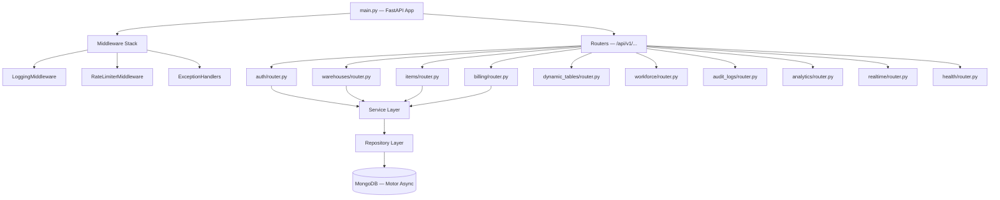

# Backend Architecture & Technical Design Audit
**Project Component**: NexWare-ERP Backend API  
**Audit Date**: May 28, 2026  
**Auditor**: Senior Backend Systems Architect  

---

## 1. Executive Summary

The NexWare-ERP backend is implemented as a **FastAPI-based Modular Monolith** using **Motor** (async MongoDB driver) and a clean **Repository–Service–Router** layered pattern. The architecture demonstrates significant engineering maturity, with proper multi-tenant isolation, stateful JWT session management with database-backed revocation, production-grade middleware stack, and a real-time WebSocket Change Stream pipeline. Overall, this is a well-structured, enterprise-capable codebase.

### 🏗️ Overall Backend Architecture Score: **8.4 / 10**

---

## 2. Project Structure & Module Map

Each module follows a strict 5-file pattern:
- `router.py` — FastAPI route definitions and dependency injection
- `service.py` — Business logic and orchestration
- `repository.py` — MongoDB query layer (the only layer that touches the database)
- `schema.py` — Pydantic v2 request/response validation models  
- `model.py` — Core business object data structure definitions

---

## 3. Multi-Tenant Isolation Architecture

Multi-tenant isolation is the foundation of the ERP and is enforced at every layer:

1. **Token Layer**: The JWT access token payload embeds `tenant_id` as a claim, derived from the user's profile at authentication time.
2. **Dependency Layer**: `get_current_user()` in `dependencies.py` decodes the token, validates user status, and returns the full user profile including `tenant_id`.
3. **Service Layer**: All service methods receive `current_user` and filter queries using `tenant_id` and `warehouse_id` simultaneously.
4. **Repository Layer**: All MongoDB queries explicitly include `{"tenant_id": tenant_id}` as a mandatory filter, making cross-tenant data bleed architecturally impossible without deliberate bypass.

**Strength**: This three-layer isolation is robust. Unlike some simpler SaaS implementations that only apply tenant scoping in the service layer, this system enforces it at the repository level, reducing the blast radius of any logic errors.

---

## 4. Authentication System Quality

| Feature | Implementation | Assessment |
| :--- | :--- | :--- |
| **Password Hashing** | Argon2id (m=65536, t=3, p=4) | 🟢 Excellent — industry best practice |
| **Access Token** | JWT HS256, 15-minute TTL | 🟢 Good — short-lived by design |
| **Refresh Token** | JWT HS256, 7-day TTL | 🟢 Good — long-lived refresh lifecycle |
| **Session Tracking** | Stateful JTI tracking in MongoDB | 🟢 Excellent — enables true server-side revocation |
| **Refresh Token Rotation** | Yes — old JTI revoked on rotation | 🟢 Excellent — prevents refresh token replay attacks |
| **Compromise Detection** | Replay detected → revoke ALL user sessions | 🟢 Excellent — defense-in-depth |
| **Role-Based Access** | `RequireRole` class-based dependency | 🟢 Good — declarative and DRY |

---

## 5. Database Design Assessment

### Collection Architecture
The database uses a well-organized set of named collections with enforced index constraints:

| Collection | Indexes | Notes |
| :--- | :--- | :--- |
| `users` | Unique `email`; `tenant_id` | Prevents duplicate accounts |
| `inventory_items` | Unique `(warehouse_id, sku)`; `(tenant_id, warehouse_id)` | Prevents duplicate SKUs per warehouse |
| `table_schemas` | Unique `(warehouse_id, table_name)` | Prevents duplicate schema names |
| `bills` | Compound `(tenant_id, created_at)` | Optimizes billing history queries |
| `audit_logs` | Compound `(tenant_id, timestamp)` | Optimizes audit trail retrieval |

### Dynamic Tables Architecture
The most architecturally notable subsystem. Instead of creating a new MongoDB collection per user-defined table (an anti-pattern), the system uses a single `table_rows` collection keyed by `schema_id`:
- **Strength**: Avoids schema proliferation and allows cross-table queries
- **Weakness**: As row counts grow, a missing wildcard index on the dynamic `data` subdocument will degrade lookup performance

---

## 6. Hidden Architectural Issues Found

### 🟡 Issue 1: Missing Wildcard Index on `table_rows.data`
- **Root Cause**: Dynamic table rows store user-defined columns in a nested `data: {}` subdocument. Without a wildcard index (`$**`), filtering by any specific column value requires a full collection scan of all rows across all schemas.
- **Risk Level**: Medium — impacts performance as dynamic table usage grows

### 🟡 Issue 2: No Explicit MongoDB Connection Pool Configuration
- **Root Cause**: `AsyncIOMotorClient` is initialized with just the URL string, relying on Motor's default connection pool settings (100 max connections). Under concurrent load spikes, the pool may become saturated.
- **Risk Level**: Medium — production risk under high concurrent user load

### 🟢 Issue 3: Standalone MongoDB — No Replica Set
- **Root Cause**: The system runs against a single standalone MongoDB node. MongoDB Change Streams (used for the real-time WebSocket pipeline) require a replica set or sharded cluster to operate. Currently, the startup code gracefully catches the stream initialization failure and degrades silently.
- **Risk Level**: Low in development, High in production — without a replica set, real-time notifications are completely unavailable

---

## 7. Improvement Recommendations

1. **Add wildcard index on `table_rows.data`**: Migrate to `db.table_rows.create_index([("data.$**", 1)])` for sub-second dynamic column filtering at scale.
2. **Configure Motor connection pool**: Set explicit `maxPoolSize=200, minPoolSize=5, serverSelectionTimeoutMS=5000` in the `AsyncIOMotorClient` constructor.
3. **Deploy MongoDB as a Replica Set**: For production, run a 3-node replica set (even on a single host using `mongod --replSet rs0`) to enable Change Streams for real-time notifications.
4. **Add Health Monitoring for Real-Time Module**: Expose a `/health/realtime` endpoint that reports whether Change Stream listeners are active, allowing operators to detect silent degradations.
