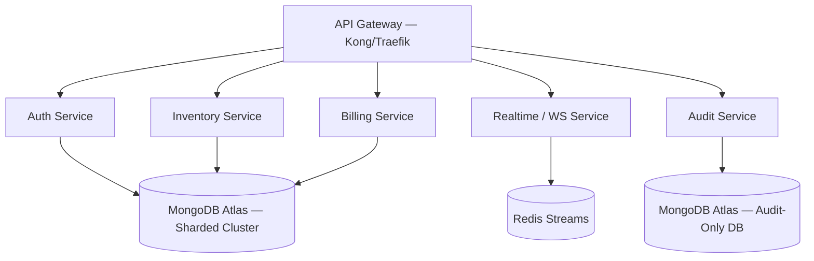

# Future Improvements Roadmap
**Project**: NexWare-ERP — Full Stack Platform  
**Document Date**: May 28, 2026  
**Author**: Senior Software Architect & SaaS Systems Analyst  

---

## 1. Overview

This roadmap defines a phased strategic improvement plan for the NexWare-ERP platform, organized into short-term security hardening (Phase 1), medium-term scalability upgrades (Phase 2), and long-term architectural evolution (Phase 3). Each item is prioritized by its business impact and engineering effort.

---

## 2. Phase 1 — Immediate Hardening (Weeks 1–4)

These items should be addressed before any external users access the system.

### 1.1 Security Hardening
- **[CRITICAL] Implement `escHtml()` HTML sanitizer** across all `innerHTML` template interpolations in all frontend page modules. This eliminates the critical stored XSS surface.
- **[CRITICAL] Validate `JWT_SECRET` at startup** — add a Pydantic validator that hard-fails if the development placeholder is used in a production environment.
- **[HIGH] Migrate JWT to `HttpOnly Secure SameSite=Strict` cookie** — removes the token from `localStorage` and eliminates the post-XSS token theft attack vector.
- **[HIGH] Add `SecurityHeadersMiddleware`** — enforce `Content-Security-Policy`, `X-Frame-Options: DENY`, `X-Content-Type-Options: nosniff`, and `Strict-Transport-Security` on all API responses.
- **[MEDIUM] Add per-account login brute-force lockout** — lock accounts for 15 minutes after 10 consecutive failed login attempts within a 5-minute window, tracked in Redis.
- **[MEDIUM] Audit all repository `find_by_id` calls** to verify `tenant_id` is always included as a mandatory filter.

### 1.2 Infrastructure Setup
- **Create `Dockerfile` for backend** using Python 3.11-slim with 4 uvicorn workers.
- **Create `Dockerfile` for frontend** using multi-stage build with Nginx static file server.
- **Create `docker-compose.yml`** orchestrating MongoDB (replica set), backend, and frontend.
- **Initialize MongoDB Replica Set** to enable Change Streams and full real-time WebSocket pipeline.
- **Configure Nginx reverse proxy** with Let's Encrypt SSL for HTTPS termination.

---

## 3. Phase 2 — Scalability & Developer Experience (Months 2–4)

### 2.1 Frontend Performance Optimization
- **Implement selective cache invalidation** — replace the global `syncWithBackend()` with granular per-resource sync functions (`syncItems()`, `syncBills()`, `syncTables()`) to eliminate the 8-parallel-call read amplification pattern.
- **Implement virtual scrolling / pagination** for the inventory table and dynamic table views to avoid rendering thousands of DOM nodes simultaneously.
- **Introduce form draft auto-save** — persist active billing invoice and table row forms to a secondary `localStorage` key so incomplete work survives session expiry or accidental navigation.
- **Debounce WebSocket-triggered re-renders** — add a 300ms debounce on re-renders triggered by WebSocket events to prevent screen flicker when multiple updates arrive in rapid succession.

### 2.2 Backend Scalability
- **Add wildcard index on `table_rows.data`**:
  ```python
  await db.table_rows.create_index([("schema_id", 1), ("data.$**", 1)])
  ```
  This enables sub-second filtering on any user-defined dynamic column at any scale.
- **Configure Motor connection pool** — set explicit `maxPoolSize=200`, `minPoolSize=5`, `serverSelectionTimeoutMS=5000`.
- **Add audit log TTL index** — retain audit logs for 2 years, then auto-expire:
  ```python
  await db.audit_logs.create_index("timestamp", expireAfterSeconds=63072000)
  ```
- **Migrate WebSocket broadcaster to Redis Pub/Sub** — enables fan-out of real-time events across multiple uvicorn worker processes and multiple server instances.
- **Add `/health/realtime` endpoint** — expose a health check that reports whether MongoDB Change Stream listeners are active.

### 2.3 Observability & Monitoring
- **Integrate Sentry** — add `sentry-sdk[fastapi]` for automatic exception capture and performance tracing.
- **Implement structured JSON logging** — replace the human-readable log format with JSON-structured logs compatible with log aggregators like Loki, Elasticsearch, or Datadog.
- **Expose Prometheus metrics** — add `/metrics` endpoint via `prometheus-fastapi-instrumentator` for RPS, error rates, and latency histograms.
- **Configure alerting** — set up Grafana or PagerDuty alerts for error rate > 1%, latency p95 > 500ms, and MongoDB connection failures.

---

## 4. Phase 3 — Long-Term Architectural Evolution (Months 6–18)

### 3.1 Frontend Framework Migration
As the number of modules grows beyond 15–20, the manual imperative DOM-building pattern in Vanilla JS will become untenable to maintain. The recommended migration path:

```
Current: Vanilla JS SPA (imperative innerHTML)
    ↓
Step 1: Introduce Lit or Preact for reactive component layer (minimal bundle impact)
    ↓
Step 2: Migrate to Next.js App Router (SSR + RSC for initial page load performance)
    ↓
Step 3: Adopt a dedicated state manager (Zustand or TanStack Query) for server cache management
```

**Next.js Migration Benefits**:
- Server-side rendering (SSR) eliminates the initial blank-screen flash
- React Server Components (RSC) dramatically reduce JavaScript shipped to the browser
- File-system-based routing replaces the custom hash router
- TypeScript adoption improves developer experience and catches type errors at compile time

### 3.2 Backend Microservice Extraction
When tenant count grows beyond ~500 active warehouses, extract high-throughput modules into independent microservices:



### 3.3 MongoDB Atlas Migration
Migrate from a self-managed MongoDB instance to **MongoDB Atlas** for:
- **Replica sets managed automatically** (3-node) — enabling Change Streams without manual setup
- **Atlas Online Archive** — automatic tiering of old audit log data to cold storage
- **Atlas Search** — full-text search on inventory item names, customer names, and audit descriptions
- **Built-in backups** with point-in-time recovery
- **Performance Advisor** — automatic index recommendations based on actual query patterns

### 3.4 Advanced Security Roadmap
- **OAuth 2.0 / SSO Integration** — add Google Workspace, Microsoft Entra ID (Azure AD), and Okta SAML support for enterprise customers who require identity federation.
- **Row-Level Security (RLS)** — extend MongoDB document-level permissions for fine-grained field-level access control across warehouse sub-teams.
- **Secrets Manager Integration** — replace `.env` file-based secret management with HashiCorp Vault or AWS Secrets Manager for production secret rotation.
- **Penetration Testing** — commission an external penetration test after Phase 1 security fixes are complete.

---

## 5. Roadmap Summary Table

| Phase | Item | Priority | Effort | Impact |
| :--- | :--- | :--- | :--- | :--- |
| **Phase 1** | `escHtml()` XSS sanitizer | 🔴 Critical | Low | Critical |
| **Phase 1** | JWT secret startup validation | 🔴 Critical | Low | Critical |
| **Phase 1** | Docker + Compose + Nginx | 🔴 High | Medium | High |
| **Phase 1** | MongoDB Replica Set | 🔴 High | Low | High |
| **Phase 2** | Selective cache invalidation | 🟡 Medium | Medium | High |
| **Phase 2** | Wildcard index `table_rows.data` | 🟡 Medium | Low | High |
| **Phase 2** | Redis Pub/Sub WebSocket broadcaster | 🟡 Medium | Medium | Medium |
| **Phase 2** | Sentry + Prometheus + Grafana | 🟡 Medium | Medium | Medium |
| **Phase 3** | Next.js frontend migration | 🟢 Long-term | High | High |
| **Phase 3** | MongoDB Atlas migration | 🟢 Long-term | Medium | High |
| **Phase 3** | OAuth 2.0 / SSO integration | 🟢 Long-term | High | Medium |
| **Phase 3** | Microservice extraction | 🟢 Long-term | Very High | Medium |
